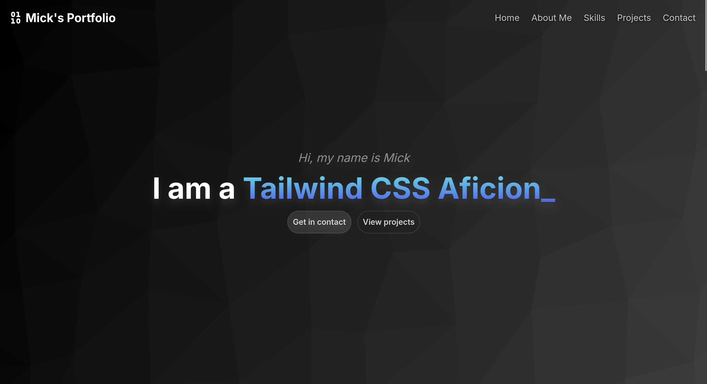

# My Portfolio

This is my portfolio project I made for school.



## Features ✨

- Responsive Design
- Smooth Animations
- Contact Form
- Projects/Skills sections

## Tech Stack 🛠️

- Astro
- TailwindCSS
- TailwindCSS Animated
- Github Pages

## Installation 🚀

```bash
# Clone the repository
git clone https://github.com/Spoorloos/spoorloos.github.io.git

# Navigate into the folder
cd spoorloos.github.io

# Install dependencies
bun install

# Run the development server
bun run dev
```
